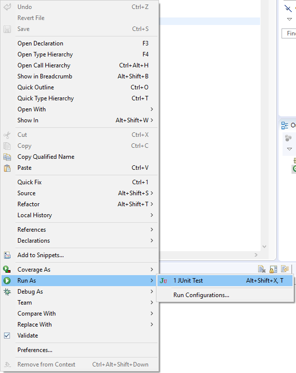
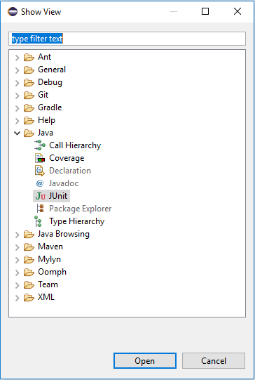
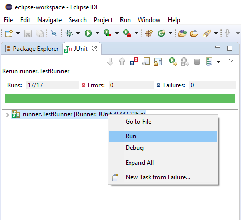

# UserInterfaceTesting.Framework.BengalTiger  
This is a User Interface testing Framework using Java, Maven, JUnit, Cucumber and Selenium WebDriver to test UltimateQA Practice site.

## Selenium WebDriver 
Selenium WebDriver is a collection of open source APIs which are used to automate the testing of a web application. Selenium WebDriver tool is used to automate web application testing to verify that it works as expected. It supports many browsers such as Firefox, Chrome, IE, and Safari. WebDriver is a web automation framework that allows you to execute your tests against different browsers. It also enables you to use a programming language in creating your test scripts. https://www.seleniumhq.org/projects/webdriver/

## Cucumber 
Cucumber's open-source and commercial collaboration tools combine with world-class training and consulting to take your engineering teams' performance to another level. https://cucumber.io/

## Project Natures

### Maven 
Apache Maven is a software project management and comprehension tool. Based on the concept of a project object model (POM), Maven can manage a project's build, reporting and documentation from a central piece of information.
https://maven.apache.org/

### JUnit 
JUnit is a simple framework to write repeatable tests. It is an instance of the xUnit architecture for unit testing frameworks.
https://junit.org/junit4/

## UltimateQA Practice site 
A free place to practice some scenarios like:
* Testing a large complicated page
* Work with simple HTML elements like buttons
* Fill out forms
* Automate an application that evolves over time

https://www.ultimateqa.com/automation/

## Integrated Development Environment
Eclipse IDE is used to develop this Framework.

### Run Tests
* Open file in Eclipse: ..\UserInterfaceTesting.Framework.BengalTiger\src\test\java\runner\TestRunner.java
* Right click => Run As
* JUnit Test

#### Shortcut:
* Alt + Shift + X, T

### Run Tests with JUnit Explorer
* Window => Show View => Other... (Alt + Shift + Q, Q)
* Java => JUnit
* Right click on runner.TestRunner
* Run

### Run Tests with Command Prompt/Windows PowerShell
* Open Folder in File Explorer: ..\UserInterfaceTesting.Framework.Tiger (where you have the "pom.xml" file)
* Open Command Prompt/Windows PowerShell
* Run "mvn clean test"

#### Notes ('mvn' is not recognized as an internal or external command)
* Download "apache-maven-3.6.1-bin.tar.gz" from "https://maven.apache.org/download.cgi#"
* Set the Environment Variables
